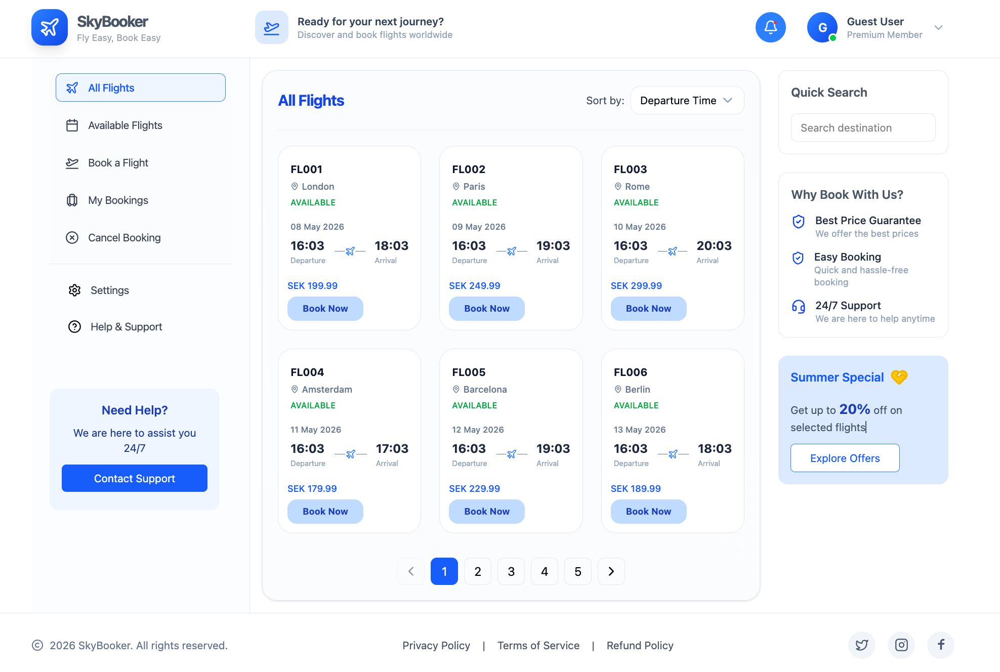

# ✈️ Flight Reservation – Project Test

This project is a modern React-based flight booking application that allows users to browse flights, search destinations, book flights, manage bookings, and cancel reservations through an intuitive and responsive UI.

## Features

* View all flights
* View only available flights
* Book a flight
* Search for bookings by email
* Cancel an existing booking 
* Responsive UI design
* Pagination support
* Simple Flight search functionality

## Tech Stack
### Frontend:

* React
* TypeScript
* React Router
* Tailwind CSS
* lucide-react Icons

### Backend:
The frontend integrates with REST APIs for:
* Fetching all flights
* Fetching available flights
* Booking flights
* Retrieving bookings by email
* Cancelling bookings

## API Endpoints

| Method | Endpoint                                       | Description           |
|--------|------------------------------------------------|-----------------------|
| GET    | `/api/flights`                                 | Get all flights       |
| GET    | `/api/flights/available`                       | Get available flights |
| POST   | `/api/flights/{flightId}/book`                 | Book a flight         |
| GET    | `/api/flights/bookings?email={email}`          | Get bookings by email |
| DELETE | `/api/flights/{flightId}/cancel?email={email}` | Cancel a booking      |

## Application Modules

* Flight Listing
* Available Flights
* Flight Booking
* My Booking
* Cancel Booking

## UI Features

* Responsive Layout
* Sidebar Navigation
* Interactive Flight Cards
* Search Functionality
* Modern Tailwind Styling
* Dynamic Booking Status Handling

